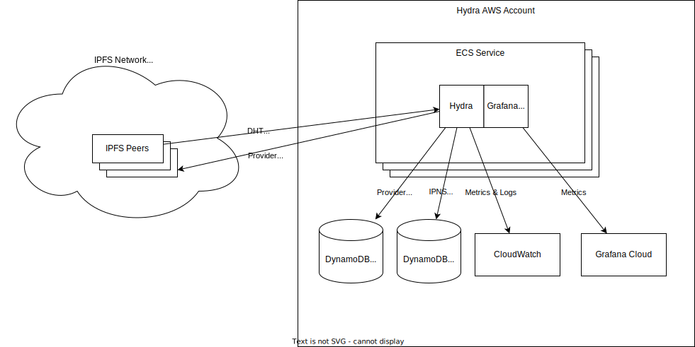

# Hydra Infrastructure

This repo contains the Terraform infrastructure that Protocol Labs uses for running [Hydras](github.com/libp2p/hydra-booster/), and operational runbooks and tooling.

You are free to look at and use this code, but Protocol Labs will provide no support for it and will not guarantee backwards compatibility.

# Dashboard

https://protocollabs.grafana.net/d/lNGQTv9Zz/hydra-boosters

# Runbook

## The hydras keep crashing

### Out Of Memory

This can happen if there is some IO causing backpressure, such as excessive retries, slow connections, etc. In the past we've seen this when the DB gets overloaded and starts slowing down. 

If the rate of incoming queries from peers is faster than the rate at which they can be completed, then goroutines start piling up and eventually the host runs out of memory.

To mitigate quickly, reduce the number of heads per host, and add more hosts to makeup for it. This will reduce the number of incoming queries on each host.

To find what's consuming all the memory, take a pprof dump (see the section below).

### Failing health checks

The hydra hosts use ECS container healthchecks, which periodically cURL the process to check for liveness. If the health check fails a few times in a row, ECS will signal recycle the container.

This can happen if e.g. the host is running very hot on CPU and is unresponsive to the health check. In this case, reduce the # heads per host and add hosts to make up for it, which will reduce the number of incoming queries on each host. See the section below for scaling the fleet.

## I need to get logs

The Grafana dashboard has a panel that shows the most recent error messages. You can customize the query to search for other logs ([documentation](https://docs.aws.amazon.com/AmazonCloudWatch/latest/logs/CWL_QuerySyntax.html)).

Otherwise, the logs are stored in CloudWatch.

## I need to find metrics

Some AWS-specific metrics are stored in CloudWatch (such as DynamoDB metrics), and some are scraped from the Hydra nodes into Prometheus. Both can be searched using Grafana.

## DynamoDB is throttling us

The DynamoDB table has two capacities, read and write. They both have autoscaling enabled. Throttling can occur if:

- There is a sudden burst in traffic
  - Auto-scaling should raise the limit within a few seconds and throttling should stop
- The auto-scaling upper limit has been reached
  - Increase the upper limit
- The DynamoDB upper limit has been reached
  - Open a quota increase request to increase the capacity limit of the table.

## I need to scale up the fleet or change the # heads:

To scale up the fleet, adjust the [Terraform variables](./variables.tf).

Then deploy the change (see below for deploying Terraform).

## I need to take pprof dumps from a hydra

## I need access to the AWS account

Engage a netops engineer.

## I need to deploy a Terraform change

Deployment permissions are restricted, so engage a netops engineer.

Open a PR with the change, get it approved, push it, and then apply it with Terraform locally:

`terraform apply`

To setup your environment for running Terraform:

* Get your IAM user credentials and add them to `~/.aws/credentials` using the `hydra-boosters` profile:

```ini
[hydra-boosters]
aws_access_key_id = ...
aws_secret_access_key = ...
```

* [Install direnv](https://direnv.net/docs/installation.html)
* [Install asdf](https://asdf-vm.com/guide/getting-started.html#_1-install-dependencies)
* Install the Terraform plugin with asdf: `asdf plugin add terraform`
* Switch to the directory containing `main.tf` (direnv should prompt you to allow)
* Install Terraform: `asdf install`
* `terraform init` / `terraform plan` / `terraform apply` as usual

## I need SSH access into a running container

ECS can inject an SSM agent into any running container so that you can effectively "SSH" into it.

* Setup your credentials for an IAM user/role that has SSM permissions
* [Install AWS CLI](https://docs.aws.amazon.com/cli/latest/userguide/getting-started-install.html)
* [Install the Session Manager plugin for AWS CLI](https://docs.aws.amazon.com/systems-manager/latest/userguide/session-manager-working-with-install-plugin.html)
* Find the ECS task ID that you want to SSH into:
  - Log in to the AWS Console
  - Go to ECS
  - Select the us-east-2 region
  - Select Clusters -> hydra-test
  - Select the Tasks tab
  - The Task ID is the UUID in the first column
* `export TASK_ID=<task_id> CONTAINER=<hydra|grafana-agent>`
* `aws ecs execute-command --region us-east-2 --task $TASK_ID  --cluster hydra-test --container $CONTAINER --command '/bin/bash' --interactive`

If you need to exfiltrate some data from a container, run the `presigned-url.py <bucket> <key>` command to generate an S3 presigned URL, which can be used to upload a file using cURL:

* Locally with your configured AWS credentials: `python presigned-url.py <bucket> dropbox/dump.tar.gz`
* Inside the container: `curl -T <local_file> '<presigned_url>'`


# Architecture Overview


[source](https://viewer.diagrams.net/?tags=%7B%7D&highlight=0000ff&edit=_blank&layers=1&nav=1#R7VvbcqM4EP0aPzqFuPsxdm5TOzObXacm%2BzZFQMGqYMuR8W2%2BfiUjsCUEJuZiZ3ZfHGiEQKdPH7VapGeMppt74s0n33AAo56uBZuecdPTdd20bfqHWbaJBZium1hCggJu2xvG6BfkRo1blyiAC6FhjHEUo7lo9PFsBv1YsHmE4LXY7BVH4lPnXghzhrHvRXnrMwriSWJ1LW1vf4AonKRPBhq%2FMvXSxtywmHgBXh%2BYjNueMSIYx8nRdDOCEUMvxSW5767gavZiBM7iKjc8v7%2FPn943tkPe0R1cvr1BtOqn41h50ZKP%2BGEbEI%2Barp%2FH7Nf38ZI%2BIBlCvE1xIdQaQNa11jOG6wmK4Xju%2BezqmlKB2ibxNKJngB6uIIkRxfQ6QuGM2mLMGuQHwMfEmsPNgYkP6B7iKYzJljbhVwf89Tm7dIefr%2Feusmxumxy4yUxv9Dg9wqzrPYL0gIOoBnT0BvRfse%2F%2B%2FDnbTKfDH3%2FEw3%2F6QM8BejtiQI4hWSGKT2tA5lBTYFsIZMZSjqRh5ZHUB1YeSeC0hiT4nEgCCUmzSySVQa5Ash54DUSu7jhXlgCUaeSBAroieO3WcLLPxbh6UGoS4xRAdsw4w8whOYrwMnj2Yn%2FSLIxTFASsoyaQzGJ1mzLt3JQ08pTs6XZEHzsM0IoehuzwZjvzpvhmmF6ijzq4qrjhkeAVzavIovIdT94LRZnbX4jcUr5f8jDNfebs0N9GiLqaGMf9%2FJKQ4utLZvD8t3BHlT%2BXMe0GcvsiyRmB1TI5gDRFWm6eHAMFN5pINZTcMJ1CbuQdpPDucS9eyK1fHu%2BYCn%2BH8RqTt4qUowDSNQLzfUY%2BpkBn1Ol%2BJswlqUGWeB1SSLfa4pCl4pCEJAu6efXxZ2uxnWJIyx0lLvIEZtrnll1LJbtdTP7lTvpASiAAqivw1BR4mq3haX1uPKWcHpwdz3x%2BxUXyEe5m9Y4yrLrwng3ANCLKCAlnwTWrINGzGWbpxiFIi9gjcXrZj7zFAvmp%2BQ5FaTPaBz%2FTyiaRBV4SH5a8L9cj2nsIS7HnxICBUNYqRV4146Q2AiMvRiuxGKbyBn%2FCI0asWJTGjSkpuyVPZMnA%2BV36QfFK6kiOQBtIHSXI5DrakSMbdo2AcxV8yefhD0%2BVk5q%2FlpAguKieFsnspB7%2B6r3ASOSlx4PWpxSDpCyaCaSZM5%2BjGTnnDLsdmtawZ91Uj%2FcslmpnAtqVbpu6OHU1wsP%2BQOi0r4sd4NfXBWyHN4MP6cxeSKpUW6qqxoWIgSFVa005hquKQd%2BVVKVjMbBVk0fhGvsDi3L4CmN%2Fgmbhb6AKGfMbUAUD2KbgcdCMKohS47QgCurKdo4%2B98R79WZs12VXJsu59YTqbK0itimF6gUUwiosVFsX0qPpl3FZ6ZesuLpc8K2quKZUGM1WlB0prplfj3%2BjXSKf5k%2F0TWxvymIg%2BaWWrzjMr4EuRxqNogXSSdLoNJQiOYKH%2B52poV4%2FsEV5VIbg0bhXvpuZj%2FtiRT9blEvVHsc9McoNR%2BrIaC3KlSgaxUF%2BrliuHKIiv4qJXhLKwHHEGKwZ2Gl23EIgq2WtgbWOUFbhVZcOpu3LXih93mlbVfatv1D6G%2FqYBL9D6cRocJEEDAc0KR9pXgBEUQKdJQbF25t1tr6%2FPH4f%2F7d2vet9ziTtWXa5661khaoQe4Z0sep8U8zs%2F9PFmvqgSjfqhfunmViaTEvdI%2FOKYae74enSsKHqmzhbGV1NK2mxuOInDydCfURVpQwvy%2FiE%2Bprik73W6mv5Agv%2FDlxCpuZ3ouUe%2BdCGsa1ftQRQWSmgXG2yOm5FwbkOGTKnyk3zVeES9xRyee%2BH8zmnwuclpbv5FXKAUuY2lhmYZ80MpOWiCQZXum3rANiaqQ3SaeCjeYItpZCm5V65lm1bFpVBoMkFipOzBnq6%2F2%2BapPn%2Bn5KM238B)

## Provider Broadcasts

Hydra heads receive broadcasts from peers about content they are providing. These drive the write traffic to DynamoDB.

## Content Routing Queries

Hydra heads also receive queries from IPFS peers looking for providers of content. These drive the read traffic to DynamoDB.

## Provider Prefetching

If a head receives a query for content that is not cached in DynamoDB, it performs "provider prefetching" to attempt to pre-cache the providers of the content for subsequent queries. The head immediately returns an empty set back to the peer and places the CID into a bounded queue for "provider prefetching". The queue is shared across all heads of a hydra. If the queue is full, then no prefetching is done for the CID, and it is discarded.

A goroutine worker pool processes the queue. A worker pulls a CID off the queue, performs a DHT query to find the providers of the CID, and caches them in DynamoDB. The query is limited by a timeout.

## Metrics Collection

The Hydras aggregate Prometheus metrics, which are scraped by the Grafana Agent sidecar and pushed to Grafana Cloud. The credentials for doing this are stored in Secrets Manager and injected as environment variables by ECS.

The Hydras do not directly publish CloudWatch metrics, but ECS, DynamoDB, etc. do, which we use in our dashboards.

## Persistent Peer IDs

We don't want to use new Peer IDs every time a host restarts or recycles. So we deterministically set each host's peer ID...but this requires having a separate ECS task definition for each host, and so a separate ECS service for each host.

Ideally each host would "lease" offsets (lock them in a DB), which would enable us to autoscale more gracefully, but that hasn't been implemented.

## DynamoDB

DynamoDB is used to cache provider records. We used to cache these in a hosted PostgreSQL DB, but scaling that was complicated ([details](https://github.com/libp2p/hydra-booster/issues/153)). To reduce the operational burden, we switched to DynamoDB, which has the following benefits for hydras:

* Horizontally scalable
* Has [TTL built-in](https://docs.aws.amazon.com/amazondynamodb/latest/developerguide/TTL.html), removing the need for running periodic GCs ourselves
* No hidden dragons with lock contention, query performance, connection limits, etc.

A single DHT puts translates into a single PutItem request to DynamoDB. 

A DHT query translates to >=1 Query requests to DynamoDB. The hydras follow the Query pagination until a pre-configured limit is reached, and then truncate the rest of the providers and return the list. The results are always sorted by TTL, so the most-recently-added providers are at the front of the list, and we truncate the least-recently-added providers. This is an important limit to prevent the hydras from spending too much time paginating queries (which would increase the latency for a query response and also create an availability risk).
